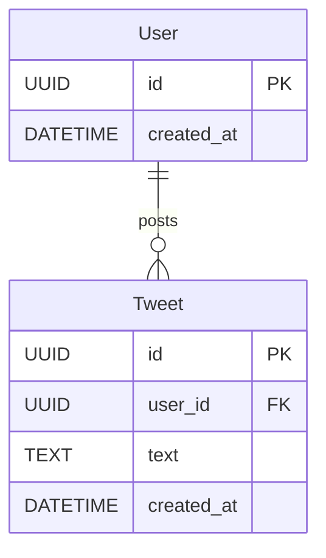

```mermaid
erDiagram
    User {
        UUID id PK
        DATETIME created_at
    }

    Tweet {
        UUID id PK
        UUID user_id FK
        TEXT text
        DATETIME created_at
    }

    User ||--o{ Tweet : "posts"

```