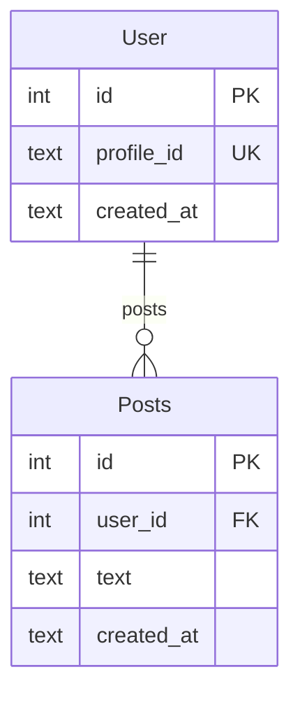

```mermaid
erDiagram
    User {
        int id PK
        text profile_id UK
        text created_at
    }

    Posts {
        int id PK
        int user_id FK
        text text
        text created_at
    }

    User ||--o{ Posts : "posts"

```