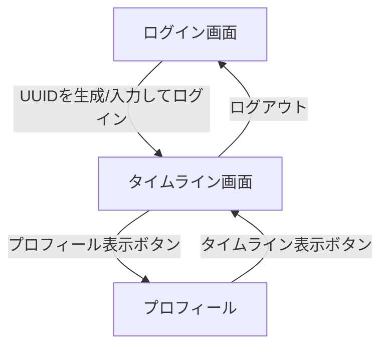

## 画面一覧

|画面名|URL|概要|
|---|---|---|
|ログイン画面|/login|ログイン・新規登録画面への遷移がある|
|新規登録画面|/register|ユーザIDの設定・UUIDの発行|
|タイムライン|/timeline|つぶやきが見える|
|プロフィール|/profile|ユーザIDが見える|

## 画面遷移図

```mermaid
flowchart TD
    A[ログイン画面] -->|UUIDを生成/入力してログイン| B[タイムライン画面]

    B -->|プロフィール表示ボタン| C[プロフィール]
    C -->|タイムライン表示ボタン| B

    B -->|ログアウト| A
```